# Payload Better Auth - Architecture

## Overview

**payload-better-auth** is a Payload CMS plugin that replaces Payload's built-in authentication with [Better Auth](https://www.better-auth.com/) — a framework-agnostic TypeScript auth library. The plugin acts as a transparent bridge: Better Auth handles all auth logic, while the adapter translates database operations into Payload's Local API.

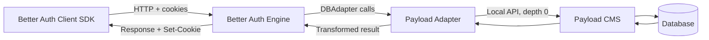
```mermaid
graph LR
    SDK[Better Auth Client SDK] -- HTTP + cookies --> BA[Better Auth Engine]
    BA -- DBAdapter calls --> Adapter[Payload Adapter]
    Adapter -- Local API, depth 0 --> PL[Payload CMS]
    PL --> DB[(Database)]

    DB --> PL
    PL --> Adapter
    Adapter -- Transformed result --> BA
    BA -- Response + Set-Cookie --> SDK
```

**Key Principle**: Better Auth core is never modified. All translation happens in the adapter and plugin layers. Users get the full Better Auth feature set with Payload as the storage and admin backend.

---

## Package Structure

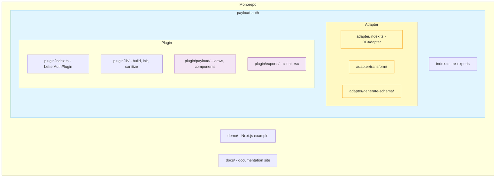
```mermaid
graph TB
    subgraph Monorepo
        subgraph payload-auth
            Index[index.ts - re-exports]
            subgraph Adapter
                AdapterCore[adapter/index.ts - DBAdapter]
                Transform[adapter/transform/]
                GenSchema[adapter/generate-schema/]
            end
            subgraph Plugin
                PluginEntry[plugin/index.ts - betterAuthPlugin]
                PluginLib[plugin/lib/ - build, init, sanitize]
                PluginUI[plugin/payload/ - views, components]
                PluginExports[plugin/exports/ - client, rsc]
            end
        end
        Demo[demo/ - Next.js example]
        Docs[docs/ - documentation site]
    end

    classDef pkg fill:#e1f5fe,stroke:#0288d1,color:#333
    classDef core fill:#fff9c4,stroke:#f9a825,color:#333
    classDef ui fill:#f3e5f5,stroke:#7b1fa2,color:#333

    class payload-auth pkg
    class Adapter,Transform,AdapterCore,GenSchema core
    class PluginUI,PluginExports ui
```

### Export Map

| Import Path | Contents |
|---|---|
| `payload-auth` | Main entry — re-exports everything |
| `payload-auth/better-auth` | Core adapter + plugin |
| `payload-auth/better-auth/adapter` | Database adapter only |
| `payload-auth/better-auth/plugin` | Plugin only |
| `payload-auth/better-auth/plugin/client` | Client-side auth utilities |
| `payload-auth/better-auth/plugin/rsc` | React Server Components |
| `payload-auth/shared/payload/fields` | Reusable Payload field components |

---

## System Layers

The system is organized into four distinct layers, each with a clear responsibility:

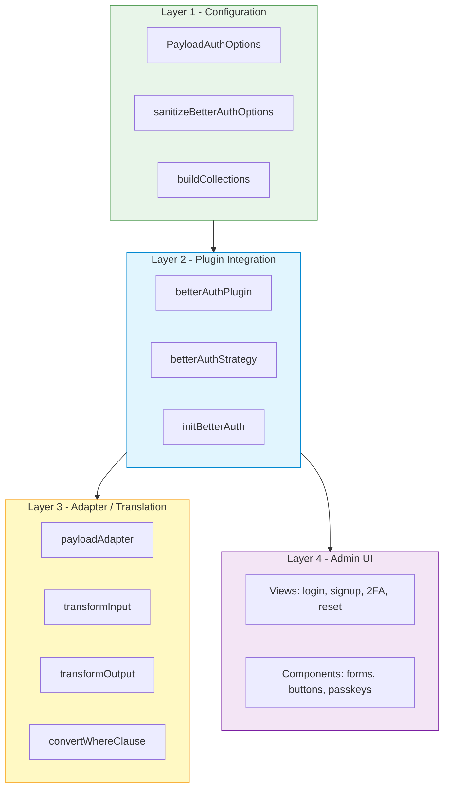
```mermaid
graph TB
    subgraph L1[Layer 1 - Configuration]
        Config[PayloadAuthOptions]
        Sanitize[sanitizeBetterAuthOptions]
        Build[buildCollections]
    end

    subgraph L2[Layer 2 - Plugin Integration]
        PluginFn[betterAuthPlugin]
        Strategy[betterAuthStrategy]
        Init[initBetterAuth]
    end

    subgraph L3[Layer 3 - Adapter / Translation]
        AdapterL[payloadAdapter]
        TInput[transformInput]
        TOutput[transformOutput]
        Where[convertWhereClause]
    end

    subgraph L4[Layer 4 - Admin UI]
        Views[Views: login, signup, 2FA, reset]
        Components[Components: forms, buttons, passkeys]
    end

    L1 --> L2 --> L3
    L2 --> L4

    classDef config fill:#e8f5e9,stroke:#388e3c,color:#333
    classDef plugin fill:#e1f5fe,stroke:#0288d1,color:#333
    classDef adapter fill:#fff9c4,stroke:#f9a825,color:#333
    classDef ui fill:#f3e5f5,stroke:#7b1fa2,color:#333

    class L1 config
    class L2 plugin
    class L3 adapter
    class L4 ui
```

---

## Plugin Initialization Flow

This is the full lifecycle from `payload.config.ts` to a running auth system:

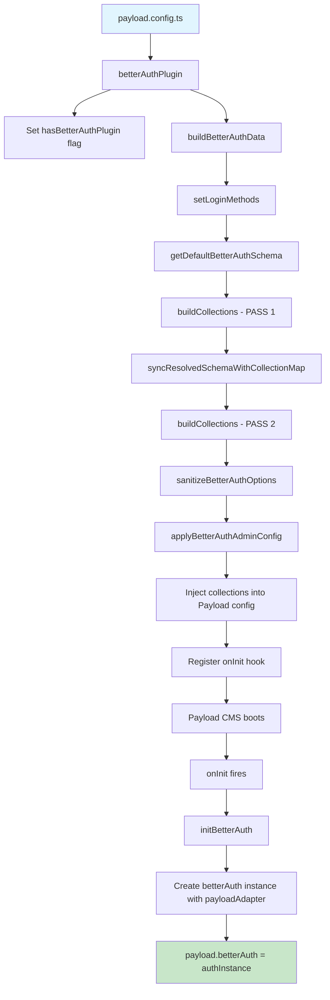
```mermaid
flowchart TD
    A[payload.config.ts] --> B[betterAuthPlugin]

    B --> C[Set hasBetterAuthPlugin flag]
    B --> D[buildBetterAuthData]

    D --> D1[setLoginMethods]
    D1 --> D2[getDefaultBetterAuthSchema]
    D2 --> D3[buildCollections - PASS 1]
    D3 --> D4[syncResolvedSchemaWithCollectionMap]
    D4 --> D5[buildCollections - PASS 2]
    D5 --> D6[sanitizeBetterAuthOptions]

    D6 --> E[applyBetterAuthAdminConfig]
    E --> F[Inject collections into Payload config]
    F --> G[Register onInit hook]

    G --> H[Payload CMS boots]
    H --> I[onInit fires]
    I --> J[initBetterAuth]
    J --> K[Create betterAuth instance with payloadAdapter]
    K --> L[payload.betterAuth = authInstance]

    style A fill:#e1f5fe,color:#333
    style L fill:#c8e6c9,color:#333
```

### Why Two Passes?

Collections are built twice because cross-collection references (hooks, endpoints) need resolved slugs. For example, the user `beforeDelete` hook cascades deletes to sessions, accounts, and passkeys — it needs their final collection slugs. Pass 1 establishes slugs; pass 2 rebuilds with correct references.

---

## Collection Builder Architecture

The plugin dynamically generates Payload collections from Better Auth's schema. Each collection type has a dedicated builder:

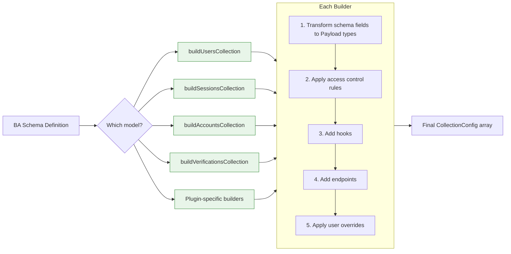
```mermaid
flowchart LR
    Schema[BA Schema Definition] --> Router{Which model?}

    Router --> Users[buildUsersCollection]
    Router --> Sessions[buildSessionsCollection]
    Router --> Accounts[buildAccountsCollection]
    Router --> Verifications[buildVerificationsCollection]
    Router --> PluginColls[Plugin-specific builders]

    subgraph BuildPipeline[Each Builder]
        direction TB
        S1[1. Transform schema fields to Payload types]
        S2[2. Apply access control rules]
        S3[3. Add hooks]
        S4[4. Add endpoints]
        S5[5. Apply user overrides]
        S1 --> S2 --> S3 --> S4 --> S5
    end

    Users --> BuildPipeline
    Sessions --> BuildPipeline
    Accounts --> BuildPipeline
    Verifications --> BuildPipeline
    PluginColls --> BuildPipeline

    BuildPipeline --> Final[Final CollectionConfig array]

    classDef builder fill:#e8f5e9,stroke:#388e3c,color:#333
    class Users,Sessions,Accounts,Verifications,PluginColls builder
```

### Field Type Mapping

| Better Auth Type | Payload Field Type |
|---|---|
| `string` | `text` |
| `number` | `number` |
| `boolean` | `checkbox` |
| `date` | `date` |
| `string[]` | `json` or `select` (for roles) |
| Foreign key (e.g., `userId`) | `relationship` |

---

## Collection Architecture

### Base Collections (always created)

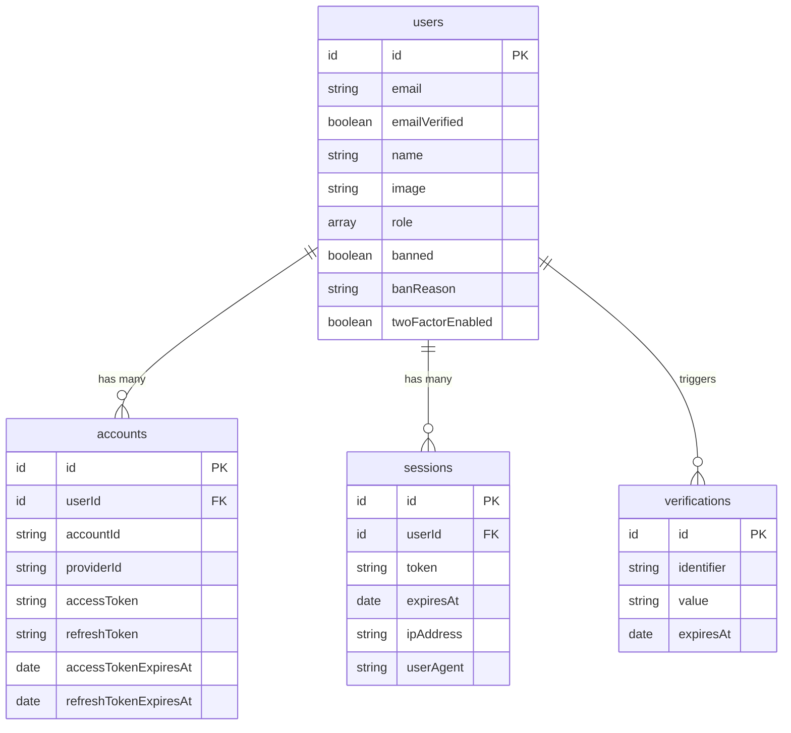
```mermaid
erDiagram
    users ||--o{ accounts : "has many"
    users ||--o{ sessions : "has many"
    users ||--o{ verifications : "triggers"

    users {
        id id PK
        string email
        boolean emailVerified
        string name
        string image
        array role
        boolean banned
        string banReason
        boolean twoFactorEnabled
    }

    sessions {
        id id PK
        id userId FK
        string token
        date expiresAt
        string ipAddress
        string userAgent
    }

    accounts {
        id id PK
        id userId FK
        string accountId
        string providerId
        string accessToken
        string refreshToken
        date accessTokenExpiresAt
        date refreshTokenExpiresAt
    }

    verifications {
        id id PK
        string identifier
        string value
        date expiresAt
    }
```

### Plugin Collections (conditional on enabled plugins)

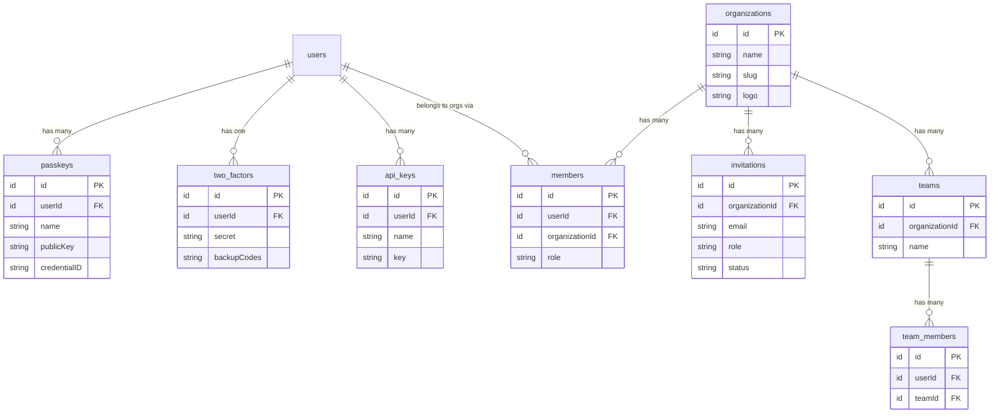
```mermaid
erDiagram
    users ||--o{ passkeys : "has many"
    users ||--o{ two_factors : "has one"
    users ||--o{ api_keys : "has many"

    passkeys {
        id id PK
        id userId FK
        string name
        string publicKey
        string credentialID
    }

    two_factors {
        id id PK
        id userId FK
        string secret
        string backupCodes
    }

    api_keys {
        id id PK
        id userId FK
        string name
        string key
    }

    users ||--o{ members : "belongs to orgs via"
    organizations ||--o{ members : "has many"
    organizations ||--o{ invitations : "has many"
    organizations ||--o{ teams : "has many"
    teams ||--o{ team_members : "has many"

    organizations {
        id id PK
        string name
        string slug
        string logo
    }

    members {
        id id PK
        id userId FK
        id organizationId FK
        string role
    }

    invitations {
        id id PK
        id organizationId FK
        string email
        string role
        string status
    }

    teams {
        id id PK
        id organizationId FK
        string name
    }

    team_members {
        id id PK
        id userId FK
        id teamId FK
    }
```

### Full Plugin Collection Index

| Plugin | Collections Created |
|---|---|
| **Base** (always) | `users`, `sessions`, `accounts`, `verifications` |
| **Admin** | `admin-invitations` |
| **Passkey** | `passkeys` |
| **Two-Factor** | `two-factors` |
| **Organizations** | `organizations`, `members`, `invitations`, `organization-roles` |
| **Teams** | `teams`, `team-members` |
| **OAuth/SSO** | `sso-providers`, `oauth-applications`, `oauth-access-tokens`, `oauth-consents` |
| **Device Auth** | `device-code` |
| **API Keys** | `api-keys` |
| **SCIM** | `scim-provider` |
| **Subscriptions** (Stripe) | `subscriptions` |
| **Rate Limiting** | `rate-limit` |
| **JWKS** | `jwks` |

---

## Complete Request Lifecycle (Sign In)

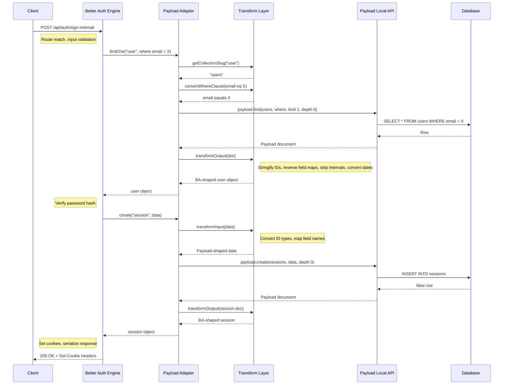
```mermaid
sequenceDiagram
    participant C as Client
    participant BA as Better Auth Engine
    participant A as Payload Adapter
    participant T as Transform Layer
    participant P as Payload Local API
    participant DB as Database

    C->>BA: POST /api/auth/sign-in/email
    Note left of BA: Route match, input validation

    BA->>A: findOne("user", where email = X)
    A->>T: getCollectionSlug("user")
    T-->>A: "users"
    A->>T: convertWhereClause(email eq X)
    T-->>A: email equals X

    A->>P: payload.find(users, where, limit 1, depth 0)
    P->>DB: SELECT * FROM users WHERE email = X
    DB-->>P: Row
    P-->>A: Payload document

    A->>T: transformOutput(doc)
    Note right of T: Stringify IDs, reverse field maps, strip internals, convert dates
    T-->>A: BA-shaped user object
    A-->>BA: user object

    Note left of BA: Verify password hash
    BA->>A: create("session", data)

    A->>T: transformInput(data)
    Note right of T: Convert ID types, map field names
    T-->>A: Payload-shaped data

    A->>P: payload.create(sessions, data, depth 0)
    P->>DB: INSERT INTO sessions
    DB-->>P: New row
    P-->>A: Payload document

    A->>T: transformOutput(session doc)
    T-->>A: BA-shaped session
    A-->>BA: session object

    Note left of BA: Set cookies, serialize response
    BA-->>C: 200 OK + Set-Cookie headers
```

---

## Adapter Operation Pattern

The adapter implements Better Auth's `DBAdapter` interface. Every operation follows the same pattern:

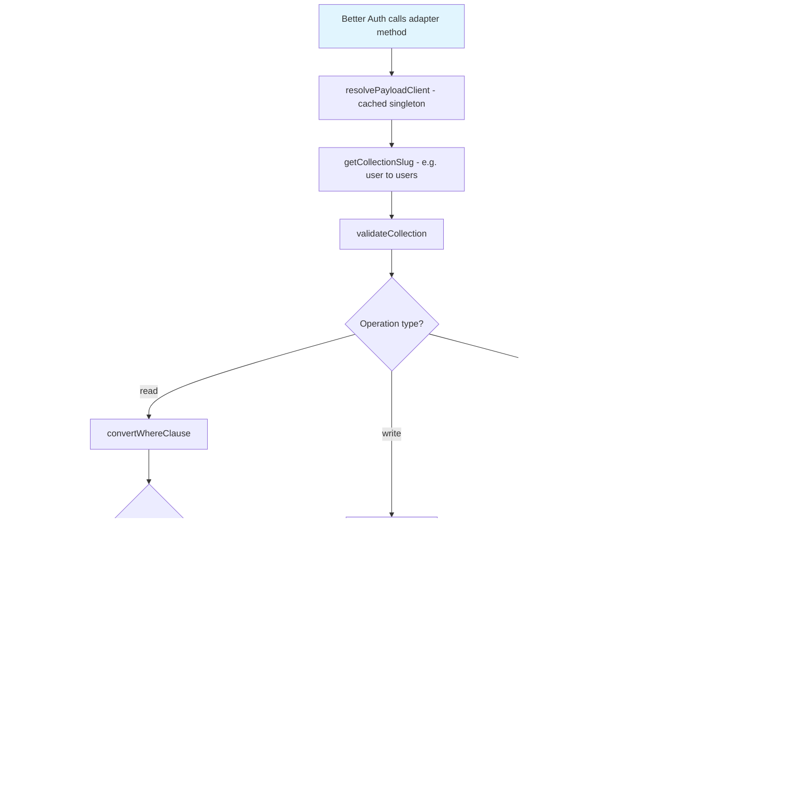
```mermaid
flowchart TD
    BA[Better Auth calls adapter method] --> RC[resolvePayloadClient - cached singleton]
    RC --> GS[getCollectionSlug - e.g. user to users]
    GS --> VC[validateCollection]
    VC --> BRANCH{Operation type?}

    BRANCH -->|read| WC[convertWhereClause]
    BRANCH -->|write| TI[transformInput]
    BRANCH -->|update = read+write| BOTH[convertWhereClause + transformInput]

    WC --> OPT{Single ID query?}
    TI --> API2[payload.create or payload.update]
    BOTH --> OPT2{Single ID query?}

    OPT -->|yes| BYID[payload.findByID - faster]
    OPT -->|no| BYWHERE[payload.find with where]

    OPT2 -->|yes| UPID[payload.update by ID - faster]
    OPT2 -->|no| UPWHERE[payload.update by where]

    BYID --> TO[transformOutput]
    BYWHERE --> TO
    API2 --> TO
    UPID --> TO
    UPWHERE --> TO

    TO --> RET[Return BA-shaped result]

    style BA fill:#e1f5fe,color:#333
    style RET fill:#c8e6c9,color:#333
```

### Adapter Methods

| Method | Description | Payload API Used |
|---|---|---|
| `create(model, data)` | Insert a document | `payload.create()` |
| `findOne(model, where)` | Fetch single record | `payload.findByID()` or `payload.find({ limit: 1 })` |
| `findMany(model, where, opts)` | Fetch multiple records | `payload.find()` |
| `update(model, where, data)` | Update record(s) | `payload.update()` |
| `updateMany(model, where, data)` | Batch update | `payload.update({ where })` |
| `delete(model, where)` | Delete single record | `payload.delete()` |
| `deleteMany(model, where)` | Batch delete | `payload.delete({ where })` |
| `count(model, where)` | Count matching records | `payload.count()` |

---

## Transform Layer Detail

The transform layer is the critical translation boundary. It ensures Better Auth always sees data in its expected shape, regardless of how Payload stores it.

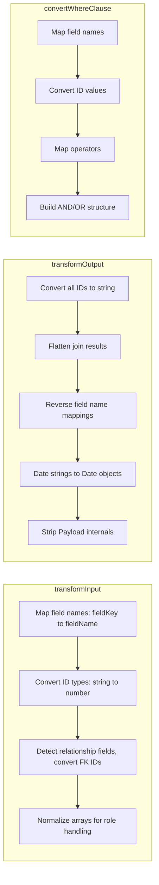
```mermaid
flowchart LR
    subgraph transformInput
        direction TB
        I1[Map field names: fieldKey to fieldName]
        I2[Convert ID types: string to number]
        I3[Detect relationship fields, convert FK IDs]
        I4[Normalize arrays for role handling]
        I1 --> I2 --> I3 --> I4
    end

    subgraph transformOutput
        direction TB
        O1[Convert all IDs to string]
        O2[Flatten join results]
        O3[Reverse field name mappings]
        O4[Date strings to Date objects]
        O5[Strip Payload internals]
        O1 --> O2 --> O3 --> O4 --> O5
    end

    subgraph convertWhereClause
        direction TB
        W1[Map field names]
        W2[Convert ID values]
        W3[Map operators]
        W4[Build AND/OR structure]
        W1 --> W2 --> W3 --> W4
    end
```

### Operator Mapping

| Better Auth | Payload |
|---|---|
| `eq` | `equals` |
| `ne` | `not_equals` |
| `gt` | `greater_than` |
| `gte` | `greater_than_equal` |
| `lt` | `less_than` |
| `lte` | `less_than_equal` |
| `in` | `in` |
| `contains` | `contains` |
| `starts_with` | `like (%)` |
| `ends_with` | `like (%)` |

---

## Payload Admin Authentication via Better Auth

The `betterAuthStrategy` bridges Payload's admin panel auth with Better Auth sessions:

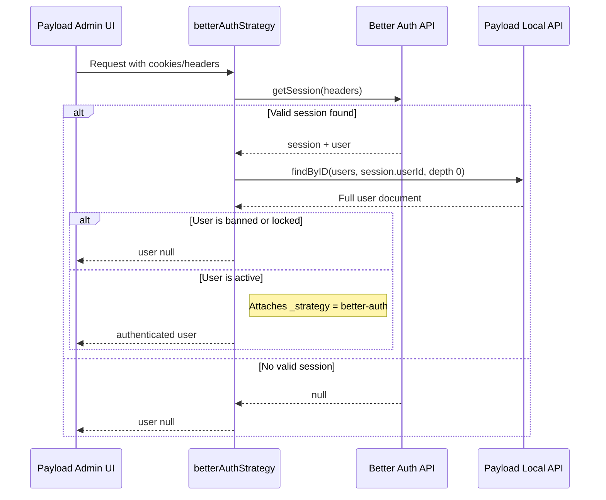
```mermaid
sequenceDiagram
    participant Admin as Payload Admin UI
    participant Strategy as betterAuthStrategy
    participant BA as Better Auth API
    participant PL as Payload Local API

    Admin->>Strategy: Request with cookies/headers
    Strategy->>BA: getSession(headers)

    alt Valid session found
        BA-->>Strategy: session + user
        Strategy->>PL: findByID(users, session.userId, depth 0)
        PL-->>Strategy: Full user document
        alt User is banned or locked
            Strategy-->>Admin: user null
        else User is active
            Note right of Strategy: Attaches _strategy = better-auth
            Strategy-->>Admin: authenticated user
        end
    else No valid session
        BA-->>Strategy: null
        Strategy-->>Admin: user null
    end
```

---

## Plugin Sanitization Pipeline

The sanitization layer processes user-provided `PayloadAuthOptions` into fully-resolved `BetterAuthOptions` that Better Auth understands:

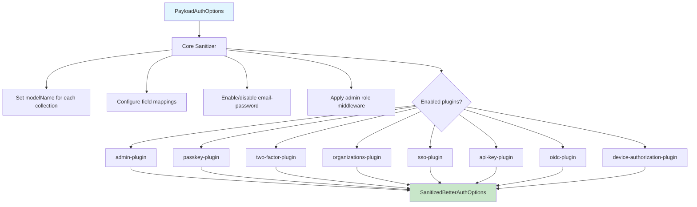
```mermaid
flowchart TD
    Input[PayloadAuthOptions] --> Core[Core Sanitizer]

    Core --> M1[Set modelName for each collection]
    Core --> M2[Configure field mappings]
    Core --> M3[Enable/disable email-password]
    Core --> M4[Apply admin role middleware]

    Core --> Plugins{Enabled plugins?}

    Plugins --> P1[admin-plugin]
    Plugins --> P2[passkey-plugin]
    Plugins --> P3[two-factor-plugin]
    Plugins --> P4[organizations-plugin]
    Plugins --> P5[sso-plugin]
    Plugins --> P6[api-key-plugin]
    Plugins --> P7[oidc-plugin]
    Plugins --> P8[device-authorization-plugin]

    P1 --> Output
    P2 --> Output
    P3 --> Output
    P4 --> Output
    P5 --> Output
    P6 --> Output
    P7 --> Output
    P8 --> Output

    Output[SanitizedBetterAuthOptions]

    classDef input fill:#e1f5fe,color:#333
    classDef output fill:#c8e6c9,color:#333
    class Input input
    class Output output
```

Each plugin configurator:
1. Sets the `modelName` for its collections (mapping to Payload slugs)
2. Configures field mappings between BA field keys and Payload field names
3. Adds any plugin-specific middleware or hooks

---

## Access Control Model

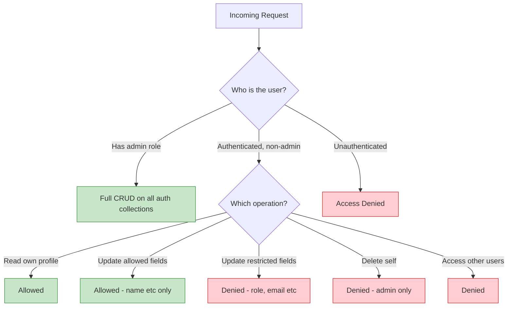
```mermaid
flowchart TD
    Request[Incoming Request] --> Check{Who is the user?}

    Check -->|Has admin role| AdminAccess[Full CRUD on all auth collections]
    Check -->|Authenticated, non-admin| SelfAccess{Which operation?}
    Check -->|Unauthenticated| Denied[Access Denied]

    SelfAccess -->|Read own profile| AllowRead[Allowed]
    SelfAccess -->|Update allowed fields| AllowUpdate[Allowed - name etc only]
    SelfAccess -->|Update restricted fields| DenyUpdate[Denied - role, email etc]
    SelfAccess -->|Delete self| DenyDelete[Denied - admin only]
    SelfAccess -->|Access other users| DenyOther[Denied]

    classDef allow fill:#c8e6c9,stroke:#388e3c,color:#333
    classDef deny fill:#ffcdd2,stroke:#c62828,color:#333

    class AdminAccess,AllowRead,AllowUpdate allow
    class Denied,DenyUpdate,DenyDelete,DenyOther deny
```

**Admin roles** are configurable via `users.adminRoles` (default: `["admin"]`). The plugin checks these roles in every access control function. Users can only update fields listed in `users.allowedFields` (default: `["name"]`).

---

## Admin UI Integration

The plugin replaces Payload's default auth views with Better Auth-powered equivalents:

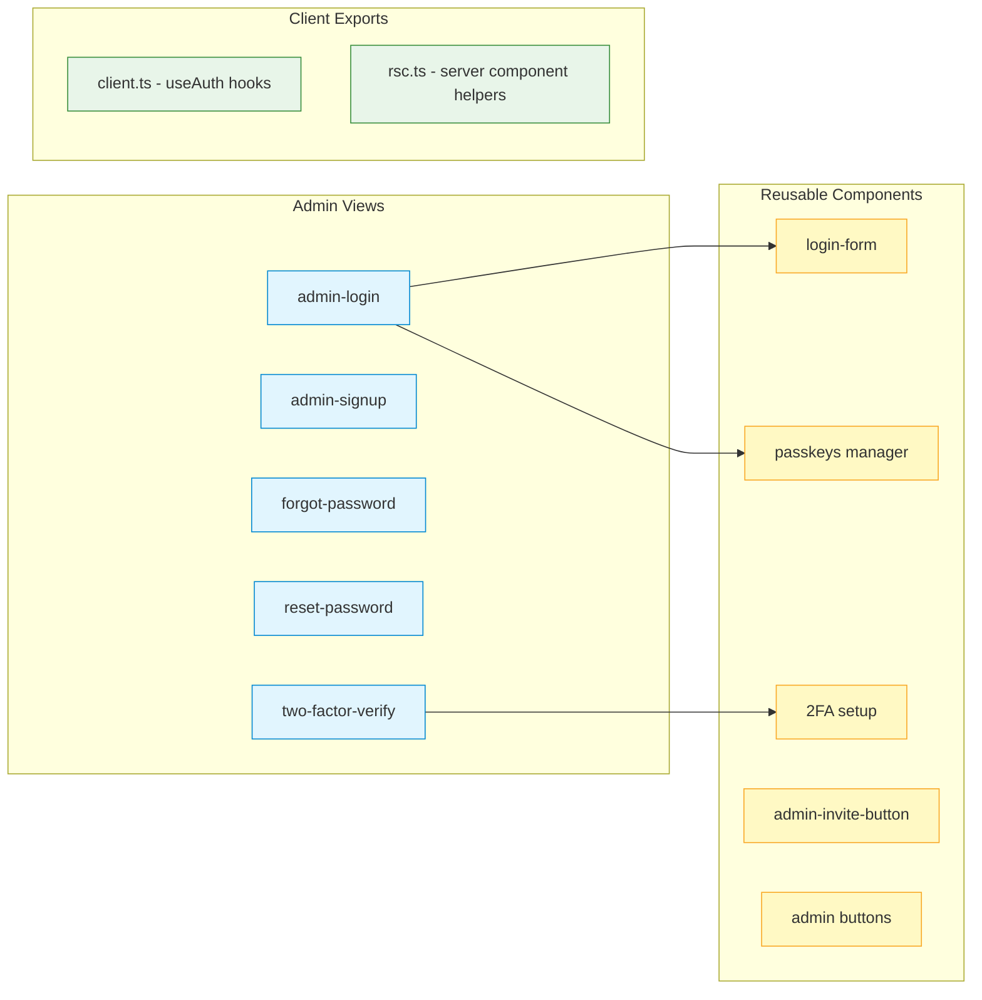
```mermaid
flowchart LR
    subgraph Views[Admin Views]
        direction TB
        Login[admin-login]
        Signup[admin-signup]
        ForgotPW[forgot-password]
        ResetPW[reset-password]
        TwoFA[two-factor-verify]
    end

    subgraph Components[Reusable Components]
        direction TB
        LoginForm[login-form]
        PasskeyMgmt[passkeys manager]
        TwoFASetup[2FA setup]
        AdminInvite[admin-invite-button]
        AdminButtons[admin buttons]
    end

    subgraph Exports[Client Exports]
        ClientTS[client.ts - useAuth hooks]
        RSCTS[rsc.ts - server component helpers]
    end

    Login --> LoginForm
    Login --> PasskeyMgmt
    TwoFA --> TwoFASetup

    classDef view fill:#e1f5fe,stroke:#0288d1,color:#333
    classDef comp fill:#fff9c4,stroke:#f9a825,color:#333
    classDef export fill:#e8f5e9,stroke:#388e3c,color:#333

    class Login,Signup,ForgotPW,ResetPW,TwoFA view
    class LoginForm,PasskeyMgmt,TwoFASetup,AdminInvite,AdminButtons comp
    class ClientTS,RSCTS export
```

---

## Users Collection - Hooks & Endpoints

The users collection is the most complex, with hooks and custom endpoints beyond standard CRUD:

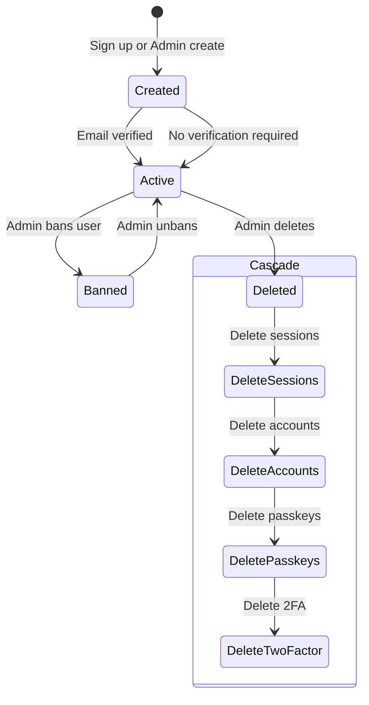
```mermaid
stateDiagram-v2
    [*] --> Created: Sign up or Admin create
    Created --> Active: Email verified
    Created --> Active: No verification required

    Active --> Banned: Admin bans user
    Banned --> Active: Admin unbans

    Active --> Deleted: Admin deletes

    state Cascade {
        Deleted --> DeleteSessions: Delete sessions
        DeleteSessions --> DeleteAccounts: Delete accounts
        DeleteAccounts --> DeletePasskeys: Delete passkeys
        DeletePasskeys --> DeleteTwoFactor: Delete 2FA
    }
```

### Custom Endpoints

| Endpoint | Description |
|---|---|
| `POST /generate-invite-url` | Create admin invitation URL |
| `POST /send-invite-url` | Email invitation to a user |
| `POST /refresh-token` | Refresh JWT tokens |

### Hooks

| Hook | Description |
|---|---|
| `beforeDelete` | Cascade delete related records (sessions, accounts, passkeys, 2FA) |
| `afterLogout` | Clean up session data |

---

## Data Contract Guarantee

The adapter is a **transparent bridge** — it never adds, removes, or modifies auth behavior. Better Auth's documented API contract is preserved exactly:

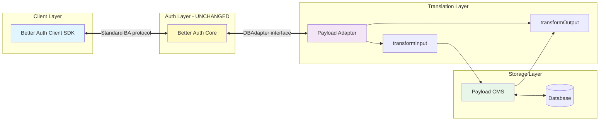
```mermaid
graph LR
    subgraph Client Layer
        Client[Better Auth Client SDK]
    end

    subgraph Auth Layer - UNCHANGED
        BA[Better Auth Core]
    end

    subgraph Translation Layer
        Adapter[Payload Adapter]
        TI[transformInput]
        TO[transformOutput]
    end

    subgraph Storage Layer
        PL[Payload CMS]
        DB[(Database)]
    end

    Client <== Standard BA protocol ==> BA
    BA <== DBAdapter interface ==> Adapter
    Adapter --> TI
    Adapter --> TO
    TI --> PL
    PL --> TO
    PL <--> DB

    style Client fill:#e1f5fe,color:#333
    style BA fill:#fff9c4,color:#333
    style Adapter fill:#f3e5f5,color:#333
    style PL fill:#e8f5e9,color:#333
```

---

## Configuration Quick Reference

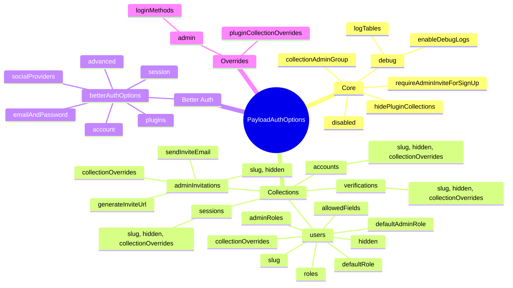
```mermaid
mindmap
    root((PayloadAuthOptions))
        Core
            disabled
            debug
                enableDebugLogs
                logTables
            hidePluginCollections
            collectionAdminGroup
            requireAdminInviteForSignUp
        Collections
            users
                slug
                roles
                adminRoles
                defaultRole
                defaultAdminRole
                allowedFields
                hidden
                collectionOverrides
            accounts
                slug, hidden, collectionOverrides
            sessions
                slug, hidden, collectionOverrides
            verifications
                slug, hidden, collectionOverrides
            adminInvitations
                slug, hidden
                generateInviteUrl
                sendInviteEmail
                collectionOverrides
        Better Auth
            betterAuthOptions
                emailAndPassword
                socialProviders
                plugins
                session
                account
                advanced
        Overrides
            pluginCollectionOverrides
            admin
                loginMethods
```

---

## Login Methods & Social Providers

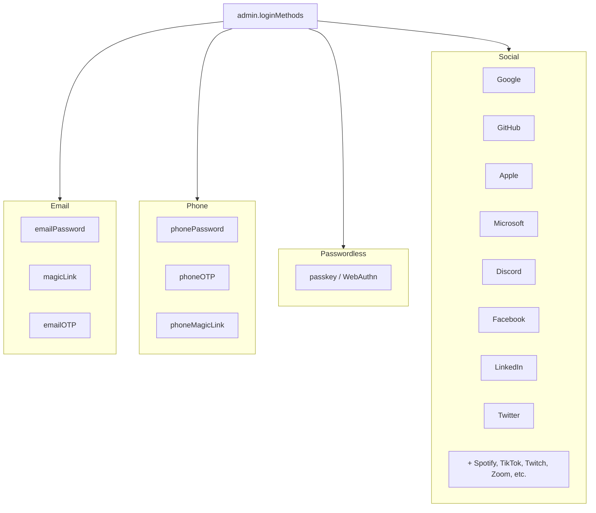
```mermaid
flowchart TB
    subgraph Email
        EP[emailPassword]
        ML[magicLink]
        OTP[emailOTP]
    end

    subgraph Phone
        PP[phonePassword]
        POTP[phoneOTP]
        PML[phoneMagicLink]
    end

    subgraph Passwordless
        PK[passkey / WebAuthn]
    end

    subgraph Social
        direction LR
        G[Google]
        GH[GitHub]
        AP[Apple]
        MS[Microsoft]
        DC[Discord]
        FB[Facebook]
        LI[LinkedIn]
        TW[Twitter]
        More[+ Spotify, TikTok, Twitch, Zoom, etc.]
    end

    Config[admin.loginMethods] --> Email
    Config --> Phone
    Config --> Passwordless
    Config --> Social
```

---

## Key Design Decisions

1. **Adapter pattern** — The plugin implements Better Auth's `DBAdapter` interface. All auth logic remains in Better Auth core, completely unchanged. No forking or wrapping.

2. **Two-pass collection build** — Collections are built twice: first to establish slugs, then again with resolved schemas so cross-collection references (hooks, endpoints) use correct slugs.

3. **`depth: 0` on all queries** — Prevents Payload from populating relationship fields, which would bloat session cookie data and leak Payload's internal structure into Better Auth responses.

4. **ID stringification** — Better Auth expects all IDs as strings. The adapter converts numeric Payload IDs to strings on output and back to numbers on input.

5. **Cookie cache** — Better Auth's `cookieCache` stores serialized session/user data in a cookie to avoid DB lookups on every request. The `saveToJWT` settings on collection fields control what gets cached.

6. **`betterAuthStrategy`** — Bridges Payload's admin panel auth with Better Auth sessions, so admin users authenticate through the same session system.

7. **Cascade deletes** — The `beforeDelete` hook on users manually deletes related records (sessions, accounts, etc.) since Better Auth expects referential integrity that Payload doesn't enforce automatically.

8. **Single ID optimization** — The adapter detects when a where clause is a simple `id = X` query and uses `payload.findByID()` instead of `payload.find()` for a faster code path.

---

## Test Architecture

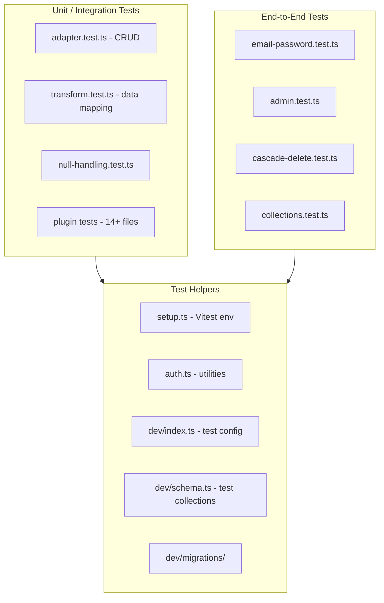
```mermaid
flowchart TB
    subgraph Unit[Unit / Integration Tests]
        AT[adapter.test.ts - CRUD]
        TT[transform.test.ts - data mapping]
        NT[null-handling.test.ts]
        PT[plugin tests - 14+ files]
    end

    subgraph E2E[End-to-End Tests]
        EPT[email-password.test.ts]
        AD[admin.test.ts]
        CD[cascade-delete.test.ts]
        CO[collections.test.ts]
    end

    subgraph Helpers[Test Helpers]
        Setup[setup.ts - Vitest env]
        Auth[auth.ts - utilities]
        Dev[dev/index.ts - test config]
        Schema[dev/schema.ts - test collections]
        Migrations[dev/migrations/]
    end

    Unit --> Helpers
    E2E --> Helpers
```

---

## Development Commands

```bash
pnpm install                        # Install dependencies
pnpm build                          # Build plugin
pnpm dev                            # Watch mode
pnpm test                           # Run tests
pnpm test:run                       # Single test run
pnpm test:payload                   # Payload CLI with test config
pnpm generate:better-auth-types     # Generate types from schema
```
